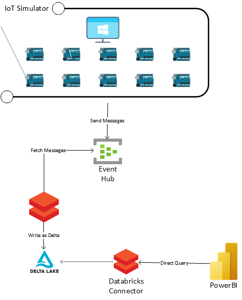

# azure-event-hub-databricks

## Introduction
This repository contains the code for building a simple end to end streaming solution in Azure using Eventhub, Databricks, and PowerBI

As shown above, the IoT simulator send messages to the Eventhub which are then fetched from a Databricks cluster. The incoming stream from the Eventhub is written to memory on the Databricks cluster and a second stream writes the parsed payload as a delta table to Azure Storage. The PowerBI report connects to the Databricks cluster and using DirectQuery to load the data. Since DirectQuery is used, the report is configured to automatically refresh the page to an interval that you choose. 
